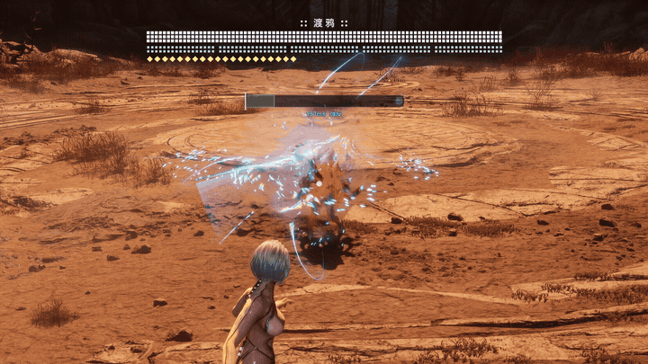
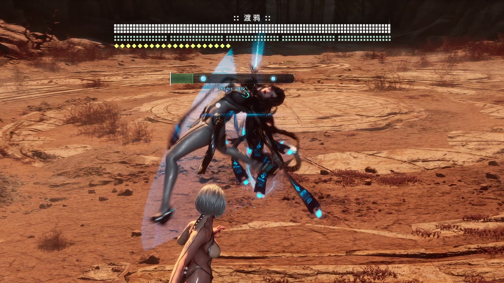
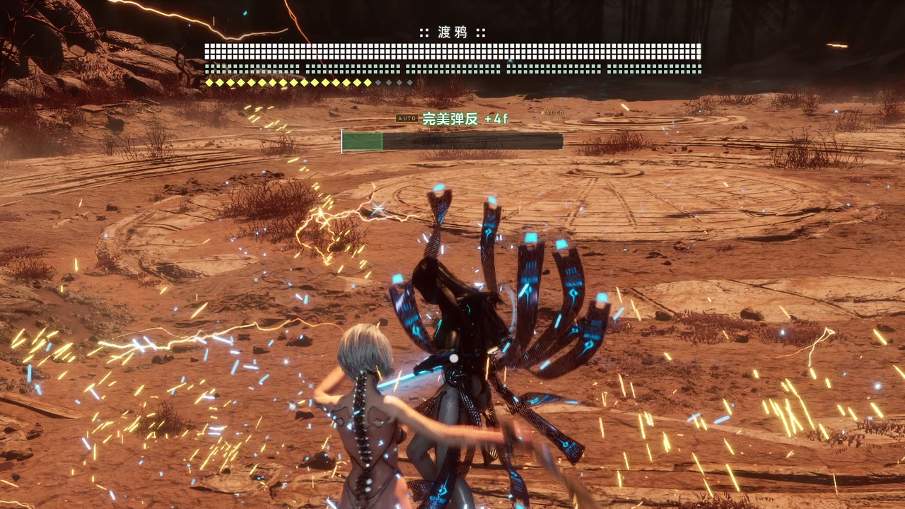
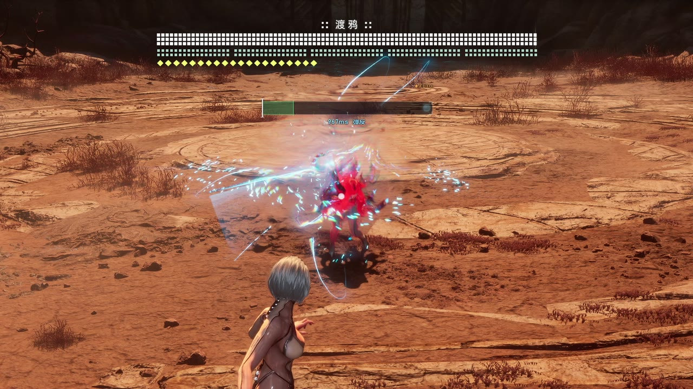

# SBParry — Stellar Blade parry / dodge timing trainer

**English** | [中文](README.zh-CN.md)

A rhythm-game style timing trainer for Stellar Blade (PC). A judgement bar shows each upcoming enemy hit about one second ahead. When you guard or dodge, SBParry reads **the game's own verdict** and tells you whether it was **PERFECT** or **how many frames early**.

- Hit timing comes from the game's own skill step table, not from recordings or hand-made timelines
- The verdict comes from the game's internal perfect-judgement function, so it matches what actually happens in game
- Blink (blue) and Repulse (violet) windows are shown too, and judged for timing, direction and range
- Ranged attacks (sword waves and other projectiles) and shockwave rings are shown as well: projectiles are tracked live, rings are predicted from game data
- Every HP loss is logged with the move that caused it, so you can find the attacks you're missing
- Chinese / English UI, follows the game's language setting by default (or the system language if that can't be read)
- Lightweight: a separate process, no DLL injected into the game and no UE4SS needed (it is only a fallback for when a game update breaks data reading); the overlay is a click-through transparent window

Fully tested, including auto parry, against the Raven and Scarlet (both phases) bosses. Other enemies go through the same data-driven logic, but not all of them have been verified in game.

> Demo video: [YouTube](https://www.youtube.com/watch?v=aZE8Sop3Tds) · [Bilibili](https://www.bilibili.com/video/BV1FQae6EEbG/)



## Screenshots

| Hits show up on the bar about 1 second ahead | After you press, the game's own verdict | Dodge-only moves (grabs etc.) are amber |
|---|---|---|
|  |  |  |

Recorded with auto parry on (the AUTO tag above the bar) and the Chinese UI; press Ctrl+Alt+J to switch to English.

## Reading the bar

Notes move toward the judgement line; the moment a note reaches the line is when the game settles that hit. Notes scroll from right to left; the judgement line is at the left end.

| Colour | Meaning | What to do |
|---|---|---|
| Cyan | Parry-able (also perfect-dodge-able) | Guard or dodge |
| Amber | Perfect-dodge only (grabs etc.) | Dodge; guarding won't work |
| Red | Neither parry nor perfect dodge possible | Get away |
| Mint (JUMP) | A shockwave ring spreading along the ground (e.g. the ring when Raven lands at the end of her back-jump combo) | **Jump over it.** Dodging doesn't help (even well-timed dodges got hit in testing); the ring is only about 40 cm tall |
| Blue span | Blink window (blue flash) | **Move toward the enemy + dodge** to teleport behind them |
| Violet span | Repulse window (purple flash) | **Move back + dodge** |
| Green zone at the line | Pressing now would be perfect | Lights up brightly when a note is fully inside |

Verdicts:

- **PERFECT**: perfect parry / perfect dodge
- **EARLY n frames**: pressed too early by n frames (at 60 fps)
- Blink / Repulse: success / early / late / wrong direction or range
- **UNHANDLED**: an enemy attack landed while you were in reach and you did nothing (no guard, dodge, blink or jump)

On Hard, sword-form parry/dodge has a 0.23 s just-action window. The game decrements it per frame and requires time left on the settling frame, so at 60 fps the usable window is **13 frames (about 217 ms)**. The green zone is drawn with this effective length.

### Ranged attacks, shockwave rings and area attacks

- **Projectiles** (e.g. Raven's sword waves): SBParry reads the projectile's actual position every frame, takes its speed from the game's projectile table, and predicts when it reaches Eve (contact distance measured at about 1.05 m). Before the projectile spawns, the note is placed from a distance/speed estimate, then switches to live tracking once it exists. The note is smoothed, so it doesn't jump at the switch.
- **Shockwave rings**: arrival time is computed from the ring's initial radius and expansion speed in the game data. Raven's ring grows from 2.8 m to 20.4 m in 1 s. The same handling covers 21 ring attacks across the bosses, but only Raven's has been tested in game so far.
- **Area attacks** that hit everything within a radius (e.g. the first hit of Raven's BurstAreaSlash, 12 m), and attacks that spawn a damage zone where they stand (e.g. Scarlet's clone slashes), are shown.
- Purely scripted "hits" such as clash or grab follow-ups have no real hit detection and are not shown.

### Damage log

SBParry reads Eve's HP bar. Every time it drops, a line goes to `sbparry.log` in the program folder:

```
Took damage -x% (move name, N ms after it started)
```

That's the quickest way to find out which move actually hit you.

## Hotkeys

| Hotkey | Action |
|---|---|
| Ctrl+Alt+M | Bar placement: under the boss HP bar (default) / follow the enemy (clamped to the central screen area) |
| Ctrl+Alt+L | Show / hide the bar |
| Ctrl+Alt+P | Show / hide the stats panel (hidden by default) |
| Ctrl+Alt+O | Move the stats panel to the next corner |
| Ctrl+Alt+J | Language 中 / EN |
| Ctrl+Alt+A | Auto parry on / off (**off** by default) |
| Ctrl+Alt+X | Auto finisher / QTE on / off (on by default; clash and grab mashing are not affected) |
| Ctrl+Alt+K | One-hit kill on / off (for skipping boss phases while practising; always starts off, not saved) |
| Ctrl+Alt+Q | Quit (restores the game code) |

The tray icon menu has the same toggles, plus Open log file and Quit. The program has no console; the log goes to `sbparry.log` in the program folder (always in English), and Open log file opens it in your default text editor (Notepad if none is associated). If some hotkeys can't be registered because another program holds them, a toast at startup lists them; use the tray menu for those. `sbparry.exe --quit` tells a running instance to restore the game code and exit.

Settings (except one-hit kill) are saved to `sbparry.ini` next to the exe.

**One-hit kill** multiplies the damage of all of Eve's attack steps by 1000 (by editing the game's skill step table in memory), so you can get past earlier phases quickly when practising a later one. It's undone when you turn it off, quit, log off / shut down Windows, or if SBParry itself crashes. Only killing SBParry from Task Manager leaves it in place, until the game is restarted.

## Installation

### Requirements

- Windows 10 / 11
- Stellar Blade PC (Steam); tested with the Steam build of 2026-08 (UE 4.26)
- No UE4SS and no mods needed. UE4SS + SBParryBridge are only needed as a fallback if a game update stops SBParry from reading the game's data (see "Fallback" below)

### Run sbparry.exe

Download `sbparry.exe` from the [Releases page](https://github.com/dawnop/stellar-blade-parry/releases/latest) or [Nexus Mods](https://www.nexusmods.com/stellarblade/mods/3903), put it in any folder and run it (settings, the log and local calibration are written next to it), before or after starting the game. It waits for the game and attaches automatically.

SBParry reads the skill step table, key bindings and the rest straight from the game's memory, read-only, from its own process. A few seconds after attaching, the log shows `Step table loaded: N rows (read directly from the game)`.

The Releases page also has a zip containing:

```
sbparry.exe            the same file as the standalone download
SBParryBridge\         UE4SS mod for the fallback, not normally needed
README.md / README.zh-CN.md / LICENSE.txt
```

Default timing calibration (Raven, Scarlet and others) is built into the exe.

**Play in borderless or windowed mode.** Overlays don't show over exclusive fullscreen.

### Fallback: UE4SS + SBParryBridge (if a game update breaks data reading)

SBParry finds the game's UE object and name tables by byte patterns. A big game update may break that; the log then says `UE globals not found`, the bar gets no notes, and about 15 s after attaching a toast says it can't read the game's data. In that case, install UE4SS and SBParryBridge: the bridge exports the same data as files and SBParry reads those instead (the log then says `Step table loaded: N rows (from SBParryBridge)`).

#### 1. Install the Stellar Blade UE4SS

Tested with "SB UE4SS 1.3" from Nexus (file id 2952 on the Stellar Blade Nexus page, a RE-UE4SS 4.0-rc dev build with Stellar Blade specific layouts).

Go to the Nexus Mods Stellar Blade page <https://www.nexusmods.com/stellarblade>, **search for "UE4SS"** and get the Stellar Blade specific build ("SB UE4SS", which ships the Stellar Blade member-variable / vtable layouts). Install it into `SB\Binaries\Win64\` following its instructions.

> The generic RE-UE4SS experimental build from GitHub does **not** work: it crashes on the first engine tick.

#### 2. Install SBParryBridge

1. Copy the `SBParryBridge` folder from the release into `SB\Binaries\Win64\ue4ss\Mods\`
2. Add this line to `ue4ss\Mods\mods.txt`:

   ```
   SBParryBridge : 1
   ```

   (The folder contains an `enabled.txt`, which most UE4SS builds honour on its own; the mods.txt line is the safe option.)

Then restart the game. The bridge is a tiny Lua script that exports what SBParry needs into its own folder:

| File | Content |
|---|---|
| `steps.tsv` | Skill step table (cast / hit steps, next step, blue/violet windows, clash/mash flag, projectile speed, attack reach, whether the hit is real, shockwave ring initial radius) |
| `live.txt` | PlayerController, world time dilation, groggy flag offsets, HP bar, cutscene QTE widget |
| `projectiles.txt` | Pooled projectile instances, perfect parry/dodge flags, speeds |
| `keys.txt` | Your current key bindings (used by auto mode) |

These files are byte-for-byte what SBParry reads directly, so both ways behave the same.

## Auto parry (off by default)

Toggle with Ctrl+Alt+A. When on, it:

- presses guard in the middle of the perfect window for parry-able hits
- presses dodge for dodge-only hits
- presses forward / back + dodge inside blue / violet windows
- jumps over shockwave rings
- mashes light attack during clashes and grab escapes (any enemy)
- presses the prompted button in cutscene QTEs (e.g. the end-of-fight QTE)
- performs the finisher: when the enemy has been broken and is down, is within 2.8 m, and has been down for about 1.2 s, it presses heavy attack (Y). Pressing earlier just gives a normal heavy attack. If that still happens, it waits 0.2 s longer next time (up to 3 s, remembered for the session)

Ctrl+Alt+X turns the finisher and QTEs off on their own; clash and grab mashing keep working.

Auto mode pauses while the game isn't in the foreground or while you hold Ctrl / Alt, so simulated keys never combine with the hotkeys. If the game doesn't take a press, it retries once. Right after a perfect dodge Eve is briefly invulnerable, and hits predicted to arrive during that time get no press for now (the game would buffer it into a mistimed dodge that then misses the next hit); if a hit actually arrives later, after the invulnerability, it is pressed as usual.

It uses your own in-game key bindings (read from the game) and follows whichever input device you last used yourself (its own simulated input doesn't count):

| Device | Method |
|---|---|
| Keyboard | SendInput |
| Xbox / XInput pad | Simulated buttons are merged into the pad state inside the game |
| DualSense (native) | Same, on the game's libScePad reads |

No virtual controller driver is needed. `autoDevice` in `sbparry.ini` can pin a device.

This is meant for practice and demonstration (e.g. seeing what correct timing looks like) in a single-player game.

## sbparry.ini

Lives next to the exe and is rewritten when you change settings in the app.

| Key | Meaning |
|---|---|
| `language` | 0 = auto (the game's language setting, or the system language if that can't be read), 1 = Chinese, 2 = English |
| `barMode` | 0 = under the boss HP bar, 1 = follow the enemy |
| `barVisible` | Show the bar |
| `panelVisible` | Show the stats panel |
| `panelCorner` | 0 top-left, 1 top-right, 2 bottom-left, 3 bottom-right |
| `autoParry` | Auto parry (default 0) |
| `autoChance` | Auto mode also handles blue / violet windows |
| `autoQte` | Auto mode also does finishers and cutscene QTEs (default 1) |
| `autoDevice` | `auto` / `keyboard` / `xinput` / `dualsense` |
| `dataSource` | Where game data comes from: `auto` (default: read game memory directly, fall back to SBParryBridge) / `native` (direct only) / `ue4ss` (UE4SS + SBParryBridge only). Restart SBParry after changing it |
| `autoAimMs` | Auto press timing offset in ms, positive = later |
| `debugLog` | Write a `timing.csv` debug log; also saves the directly read data as `native_*.tsv` / `native_*.txt` (for comparing with the bridge's export) |
| `uiScale` | Bar scale in percent (default 100) |

## FAQ

**I can't see the overlay**
- Switch the game to borderless or windowed. Exclusive fullscreen hides overlays.
- Run sbparry.exe as the same Windows user as the game (not one elevated and one not).
- Make sure the bar isn't hidden (Ctrl+Alt+L).
- The bar and stats panel only show while the game window is in the foreground.
- Use Open log file in the tray menu and check for errors.

**No notes / "can't read the game's data"**
- Open the log and look for the `Step table loaded` line. It normally appears within a few seconds of attaching.
- If the log says `UE globals not found`, or after about 15 s a toast says it can't read the game's data, a game update most likely broke data reading. Install UE4SS + SBParryBridge as described under "Fallback" above.
- Already using the fallback and the toast says "Waiting for SBParryBridge to export the step table":
  - The bridge isn't loaded. Open the UE4SS console and look for `[SBParryBridge] exported ... steps`.
  - Check that the folder is `ue4ss\Mods\SBParryBridge\Scripts\main.lua` (no extra nesting) and that `mods.txt` has `SBParryBridge : 1`.
  - Make sure you're using the Stellar Blade UE4SS build.
  - A `steps.tsv` should appear in `ue4ss\Mods\SBParryBridge\`.

**The log says the patterns didn't match**
- The game update changed the code SBParry looks for. Byte-pattern scanning survives minor patches; bigger ones may need a tool update.
- This message is about the three hook patterns; without them SBParry doesn't attach at all and needs a tool update. If only the two data-reading patterns fail (the log says `UE globals not found`), the hooks still work and UE4SS + SBParryBridge keep it usable.

**Is it safe? Anti-cheat?**
- Stellar Blade is a single-player game with no anti-cheat and no competitive features.
- SBParry does patch game memory at runtime (a few tiny hooks), so use it at your own risk. Quitting via Ctrl+Alt+Q or the tray menu restores the original code.

**Auto parry doesn't press anything**
- The game window must be in the foreground, and Ctrl / Alt must not be held (auto mode pauses while they are).
- Check your bindings: only single keys are used (bindings with Shift/Ctrl/Alt are skipped).
- Gamepad: touch the pad once so it's detected as the current device, or set `autoDevice`.
- The bar shows an AUTO mark when auto parry is on.

**What is calibration?**
- The time from a hit step starting to the game actually settling it differs per attack. SBParry learns it automatically after a couple of hits and stores it in `calib.tsv` for next time.
- The exe has built-in default calibration for Raven, Scarlet and other bosses (`data/calib_default.tsv` in the source). Other enemies may be slightly off the first time and improve after a few hits.

**I keep getting hit by a shockwave ring**
- It's a ring along the ground (the mint JUMP note). You can't dodge it; jump. Auto mode jumps on its own.

**The auto finisher came out as a heavy attack**
- Finisher and heavy attack share the same button (Y). Right after the enemy goes down the finisher isn't available yet, so the press becomes a normal heavy attack. SBParry adds 0.2 s to its wait and gets it right next time.

**How do I find out which move hit me?**
- Look for the "Took damage" line in `sbparry.log` (Open log file in the tray menu). It names the move and how many ms after it started the hit landed.

**It looked green but I got "early"**
- The game settles on the **last** frame the attack touches you, not the first. The window must still have time left at that frame.
- Everything is quantised to frames: a 0.23 s window is effectively 13 frames at 60 fps, so one frame at the edge flips the result.
- Uncalibrated attacks can be off by tens of milliseconds until they're learned.

## Building from source

Visual Studio 2022 (MSVC, C++17, x64 tools with MASM).

```bat
build.bat
```

Compiles `src\*.cpp`, `src\hooks.asm` (ml64) and `res\sbparry.rc` (rc). If `cl`, `ml64` or `rc` isn't on PATH, the script loads the VS developer environment itself; if that still fails, run it from the "x64 Native Tools Command Prompt for VS 2022".

`package.bat 1.0.0` builds first, then writes `dist\sbparry.exe` (usable on its own) and zips `sbparry.exe`, `SBParryBridge` and the docs into `dist\SBParry-1.0.0.zip`. The default calibration `data\calib_default.tsv` is compiled into the exe via `res\sbparry.rc`; during development a file of the same name next to the exe takes precedence.

The program icon is `res\sbparry.ico` (an original design: blade, four-point star and a parry arc), used by the exe and the tray. It's generated by `tools\icon\make_icon.py` (needs Pillow).

How it works: [docs/how-it-works.en.md](docs/how-it-works.en.md).

## Disclaimer

- Fan-made, unofficial. Not affiliated with SHIFT UP or Sony Interactive Entertainment. Stellar Blade is a trademark of its respective owners.
- A practice tool for a single-player game. It modifies game memory at runtime; use at your own risk.
- Auto parry and one-hit kill are for practice and demonstration.

## License

[MIT](LICENSE)
